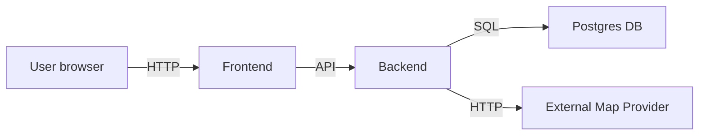

GenLogs — MVP

Overview

GenLogs is a minimal viable product (MVP) for visualizing and comparing logistics routes. It provides a React (Vite) frontend with an autocomplete cities input, route search, carrier filtering and a map visualization. The backend is a FastAPI service that serves city search, route search and metrics and persists data in Postgres for local development.

Key features (MVP)

- Cities autocomplete (typeahead)
- Search routes between origin and destination
- Compare carriers and route summaries
- Map visualization of routes (lazy-loaded to avoid bundler/runtime issues)

Architecture

A simple architecture for local development:

Frontend (Vite + React) -> Backend (FastAPI) -> Database (Postgres)
                             |
                             -> External map provider (Google Maps / Place IDs)

Mermaid (optional) - Architecture

Data model (high level)

- City: id, name, place_id
- Route: id, origin_id, destination_id, summary, distance, duration
- Carrier: id, name
- RouteCarrier: route_id, carrier_id, price, transit_time

ASCII data diagram

[City] 1---* [Route] *---* [Carrier]

Local development

Prerequisites

- Node.js (recommended LTS)
- npm or yarn
- Python 3.12+ and virtualenv (project contains a .venv)
- Postgres (for full local backend; some endpoints may run with mock providers)

Frontend (run)

1. cd frontend
2. npm install
3. npm run dev
4. Open http://localhost:5173

Notes

- The frontend includes a Vite dev proxy configuration to forward `/api` requests to the backend at http://localhost:8000 (see frontend/vite.config.ts). This avoids CORS in development.
- The Map component is lazy-loaded (React.lazy + Suspense) to prevent runtime "require is not defined" errors when the ESM build is served.

Backend (run)

1. cd backend
2. python -m venv .venv
3. .venv/bin/pip install -r requirements.txt OR use the provided pyproject (pip install -e .[dev])
4. Start the app using `uv` (preferred):
   uv run uvicorn app.main:app --host 127.0.0.1 --port 8000 --reload
   (Alternative: .venv/bin/python -m uvicorn app.main:app --host 127.0.0.1 --port 8000 --reload)
5. Health endpoint: http://127.0.0.1:8000/health

CORS and dev notes

- For development the backend is restricted to accept requests from http://localhost:5173 (configured in app.main). Production deployments should use environment-driven config and a narrower set of origins.
- If the Vite proxy is enabled, the frontend will call `/api/*` and the proxy will forward requests to the backend, avoiding CORS issues in the browser.

Database & seed

- Migrations are managed via Alembic (scripts exist under backend/). Run migrations before seeding.
- Example (project root):
  - PYTHONPATH=./backend/src uv run alembic -c backend/alembic.ini upgrade head
  - PYTHONPATH=./backend/src uv run python backend/scripts/seed_data.py

Testing

- Frontend unit tests: `cd frontend && npm test`
- Backend tests: run pytest in the backend package (uses the project's .venv)

Contributing / Notes

- This README is a brief guide for the MVP. For production deployments, add environment-based configuration, stronger CORS policies, auth and secrets management.
- The map provider is abstracted behind provider modules (see backend/src/app/providers/maps). Replace or configure API keys as needed.

License

MIT
