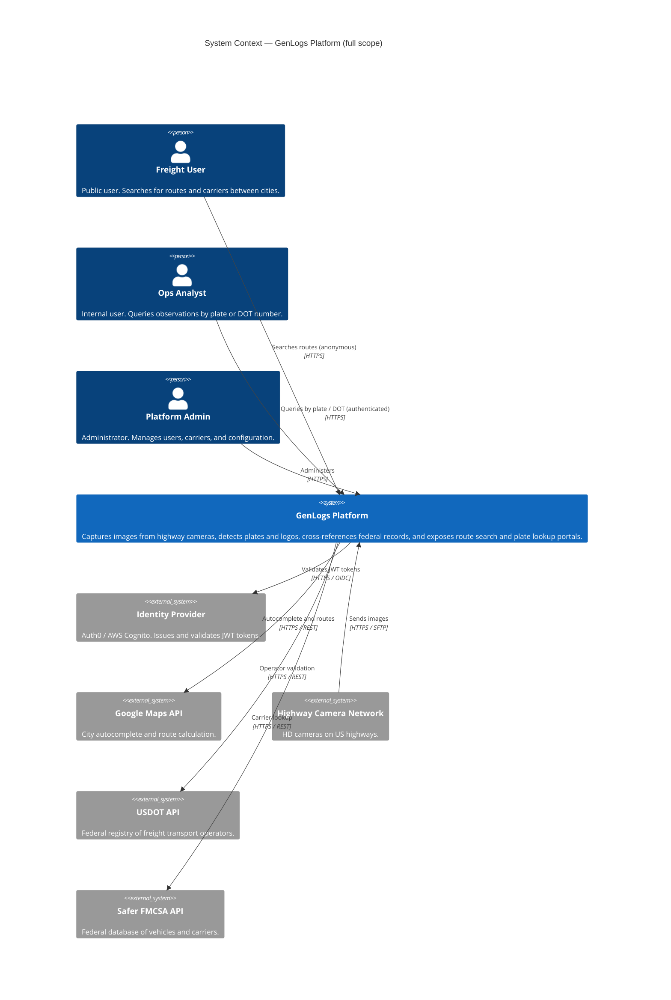
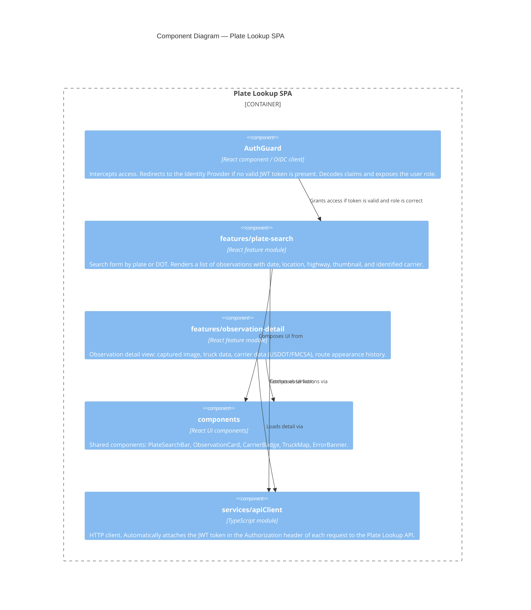
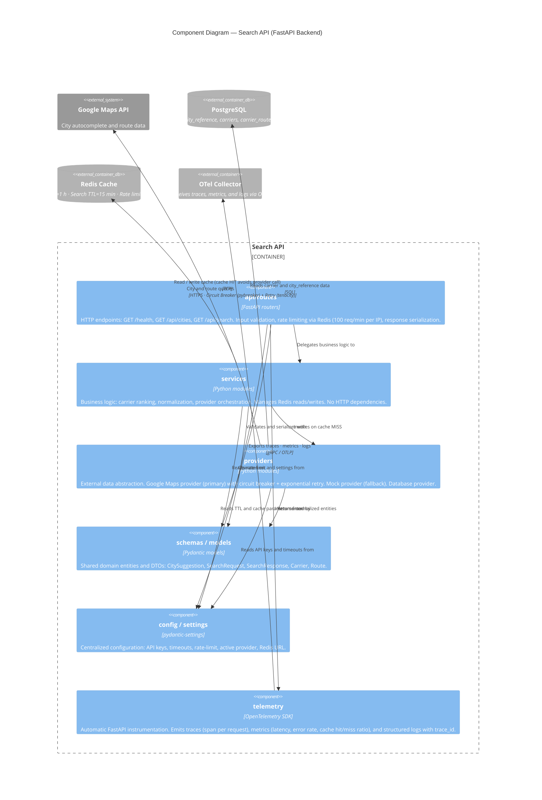
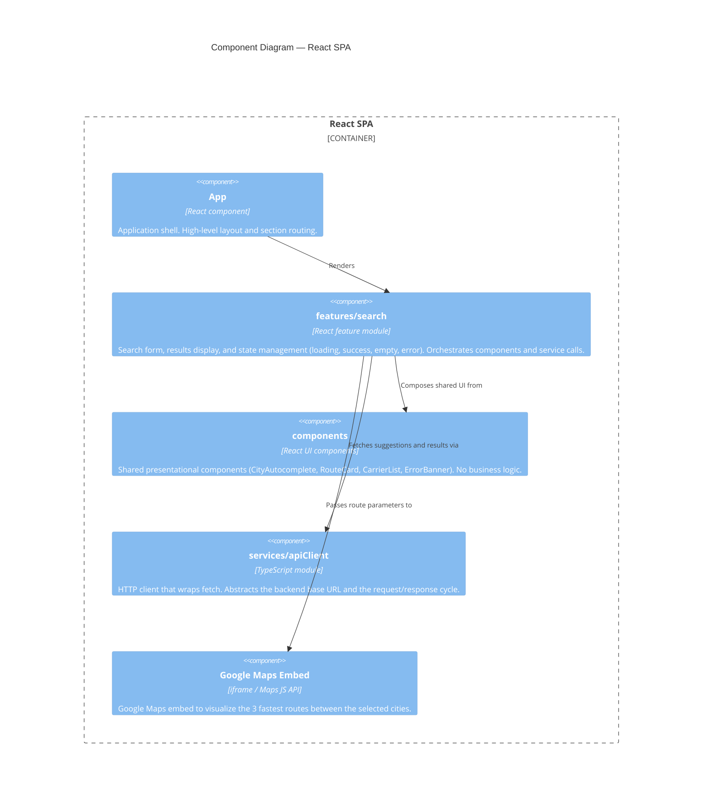
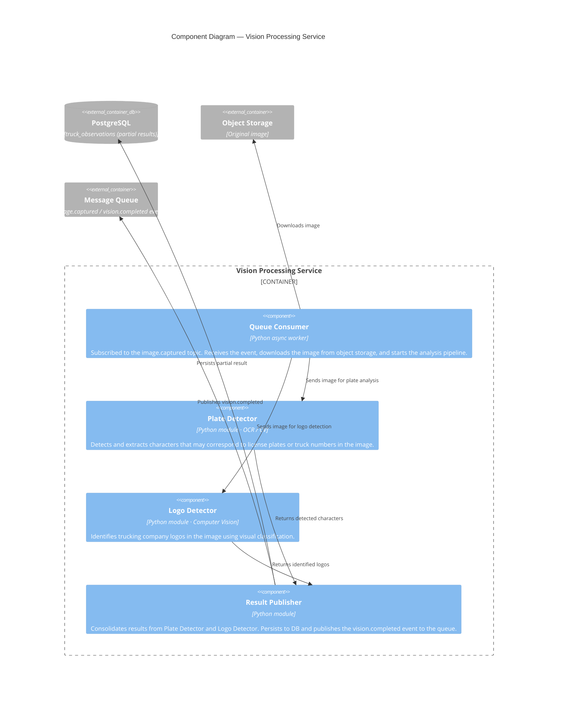
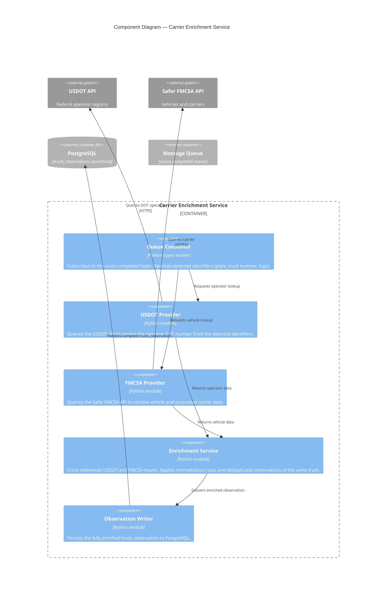
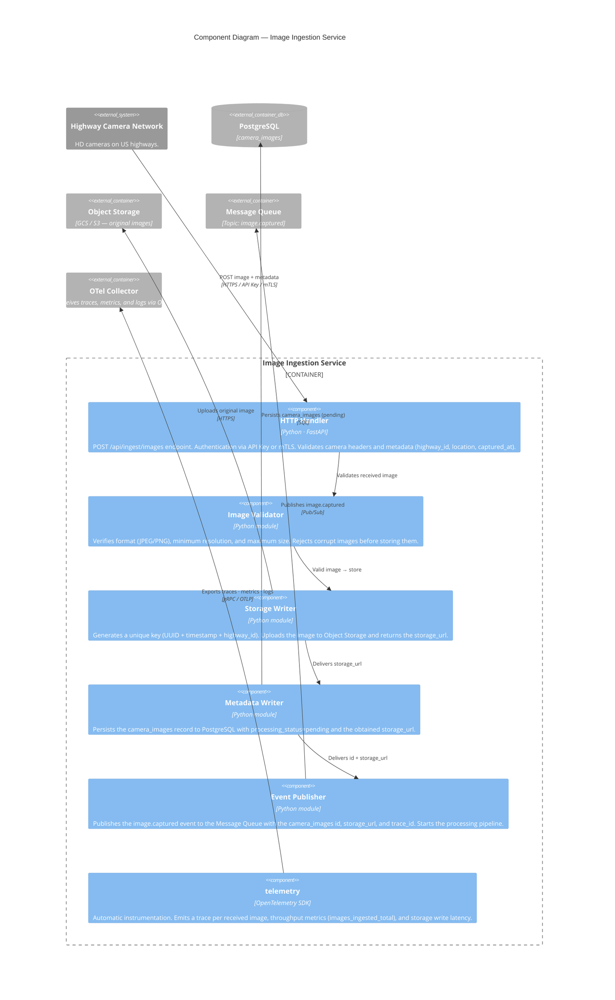
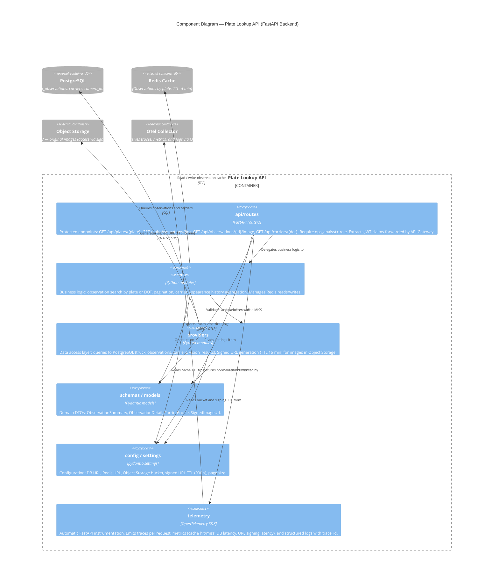

# GenLogs Platform — C4 Architecture

## Scope
This document describes the architecture of the **GenLogs Platform** in C4 format (Context → Containers → Components) for the full platform.

- **Level 1 (Context):** high-level view of the system: image capture, processing, USDOT/FMCSA integration, route search portal, and plate lookup portal.
- **Level 2 (Containers):** all platform containers, including security (API Gateway + Identity Provider), DLQ, Redis, Data Warehouse, and observability layer.
- **Level 3 (Components):** internal detail of each main container: Plate Lookup SPA, Search Portal SPA, Search API, Plate Lookup API, Image Ingestion Service, Vision Processing Service, Carrier Enrichment Service.

### Topics covered in this document
1. C4 Architecture (L1 → L3)
2. Carrier plate lookup frontend
3. Security: authentication and authorization (RBAC)
4. Unified database schema (full system)
5. Dead-Letter Queue: rationale and configuration
6. Data retention strategy
7. Object Storage vs. Data Warehouse

---

## Level 1 — System Context (full platform)

Shows GenLogs in relation to all its users and external systems. Three user types are distinguished with different access levels (see Security section).



---

## Level 2 — Container Diagram (full platform)

Shows all runtime containers. Includes: API Gateway (single entry point and auth enforcement), Plate Lookup SPA, DLQ, Data Warehouse, and ETL pipeline.

```mermaid
C4Container
    title Container Diagram — GenLogs Platform

    %% ── Personas ────────────────────────────────────────────────
    Person(freightUser, "Freight User")
    Person(opsAnalyst, "Ops Analyst")
    Person(admin, "Platform Admin")

    %% ── Presentation layer ──────────────────────────────────────
    System_Boundary(frontends, "Web Portals") {
        Container(searchSpa, "Search Portal SPA", "React 18 · Vite · TypeScript", "Public portal. Route search and carrier ranking. No login required.")
        Container(plateSpa, "Plate Lookup SPA", "React 18 · Vite · TypeScript", "Internal portal. Observation queries by plate / DOT. Login required (ops_analyst+).")
    }

    %% ── API layer ───────────────────────────────────────────────
    System_Boundary(apiLayer, "API Layer") {
        Container(apiGateway, "API Gateway", "Kong / AWS API Gateway", "Single entry point. JWT verification, RBAC, global rate limiting, routing, and access logging.")
        Container(searchApi, "Search API", "Python 3.12 · FastAPI · Uvicorn", "Validates requests, orchestrates carrier ranking, and delegates to the maps provider.")
        Container(plateApi, "Plate Lookup API", "Python 3.12 · FastAPI · Uvicorn", "Observation queries by plate, DOT, and carrier. Accessible only with ops_analyst+ role.")
    }

    %% ── Processing pipeline ─────────────────────────────────────
    System_Boundary(pipeline, "Image Processing Pipeline") {
        Container(ingestionService, "Image Ingestion Service", "Python · FastAPI / Worker", "Receives images from cameras, stores in Object Storage, and publishes image.captured.")
        Container(visionService, "Vision Processing Service", "Python · async Worker", "Detects plates, truck numbers, and logos. Publishes vision.completed or re-queues to DLQ.")
        Container(enrichmentService, "Carrier Enrichment Service", "Python · async Worker", "Queries USDOT + FMCSA. Persists enriched truck_observation or re-queues to DLQ.")
        Container(dlqWorker, "DLQ Worker", "Python · Worker", "Consumes failed messages. Generates alerts and records to audit_log for manual review.")
        Container(etlPipeline, "ETL Pipeline", "Python · Airflow / dbt", "Exports enriched observations from PostgreSQL to the Data Warehouse (daily run).")
    }

    %% ── Storage layer ───────────────────────────────────────────
    System_Boundary(storage, "Storage") {
        ContainerDb(db, "PostgreSQL", "PostgreSQL 15", "Operational DB: city_reference, carriers, carrier_routes, truck_observations, camera_images, users, audit_log.")
        Container(redis, "Redis Cache", "Redis 7", "Distributed cache shared across all instances. Cities cache: TTL=1 h. Search cache: TTL=15 min. Rate limiting state. Session tokens.")
        Container(objectStorage, "Object Storage", "GCS / S3", "Original images. Lifecycle: hot 90 d → nearline 1 year → archive.")
        Container(messageQueue, "Message Queue", "Cloud Pub/Sub · RabbitMQ", "Topics: image.captured, vision.completed. Decouples ingestion from processing.")
        Container(dlq, "Dead-Letter Queue", "Cloud Pub/Sub DLQ", "Failed messages after 3 retries. Retention 7 days + DB record.")
        ContainerDb(dataWarehouse, "Data Warehouse", "BigQuery / Redshift", "Historical analytics. Indefinite retention. Fed by ETL Pipeline.")
    }

    System_Boundary(observability, "Observability") {
        Container(otelCollector, "OTel Collector", "OpenTelemetry Collector", "Aggregates traces, metrics, and logs from all services. Routes to observability backends.")
        Container(grafanaStack, "Grafana Stack", "Prometheus · Loki · Tempo · Grafana", "Metrics (Prometheus), structured logs (Loki), distributed traces (Tempo). Dashboards and alerts in Grafana.")
    }

    %% ── External systems ─────────────────────────────────────────
    System_Ext(authProvider, "Identity Provider", "Auth0 / Cognito")
    System_Ext(googlemaps, "Google Maps API")
    System_Ext(cameraNetwork, "Highway Camera Network")
    System_Ext(usdot, "USDOT API")
    System_Ext(saferFmcsa, "Safer FMCSA API")

    %% ── Relationships: users → frontend ─────────────────────────
    Rel(freightUser, searchSpa, "Uses (anonymous)", "HTTPS")
    Rel(opsAnalyst, plateSpa, "Queries by plate / DOT", "HTTPS")
    Rel(admin, plateSpa, "Administers and queries", "HTTPS")

    %% ── Relationships: frontend → API layer ─────────────────────
    Rel(plateSpa, authProvider, "Login / obtains JWT", "HTTPS / OIDC")
    Rel(searchSpa, apiGateway, "City and route requests", "HTTPS / JSON")
    Rel(plateSpa, apiGateway, "Observation queries + JWT", "HTTPS / JSON")
    Rel(apiGateway, authProvider, "Validates JWT", "HTTPS")
    Rel(apiGateway, searchApi, "Public routes", "HTTP / JSON")
    Rel(apiGateway, plateApi, "Protected routes (ops_analyst+)", "HTTP / JSON")

    %% ── Relationships: APIs → storage / external ─────────────────
    Rel(searchApi, googlemaps, "Cities and routes", "HTTPS · CB + Retry")
    Rel(searchApi, redis, "Read / write cities and search cache", "TCP")
    Rel(searchApi, db, "Read city_reference, carriers, carrier_routes", "TCP / SQL")
    Rel(plateApi, redis, "Read / write observation cache", "TCP")
    Rel(plateApi, db, "Read truck_observations, carriers", "TCP / SQL")

    %% ── Relationships: pipeline ──────────────────────────────────
    Rel(cameraNetwork, ingestionService, "Sends images", "HTTPS / SFTP")
    Rel(ingestionService, objectStorage, "Stores original image", "HTTPS")
    Rel(ingestionService, messageQueue, "Publishes image.captured", "Pub/Sub")
    Rel(visionService, messageQueue, "Consumes image.captured", "Pub/Sub")
    Rel(visionService, objectStorage, "Downloads image for analysis", "HTTPS")
    Rel(visionService, db, "Persists partial vision_result", "TCP / SQL")
    Rel(visionService, messageQueue, "Publishes vision.completed", "Pub/Sub")
    Rel(visionService, dlq, "Re-queues after 3 failures", "Pub/Sub")
    Rel(enrichmentService, messageQueue, "Consumes vision.completed", "Pub/Sub")
    Rel(enrichmentService, usdot, "Validates DOT operator", "HTTPS")
    Rel(enrichmentService, saferFmcsa, "Carrier lookup", "HTTPS")
    Rel(enrichmentService, db, "Persists enriched truck_observation", "TCP / SQL")
    Rel(enrichmentService, dlq, "Re-queues if enrichment fails", "Pub/Sub")
    Rel(dlqWorker, dlq, "Consumes failed messages", "Pub/Sub")
    Rel(dlqWorker, db, "Records failure to audit_log", "TCP / SQL")
    Rel(etlPipeline, db, "Reads enriched observations", "TCP / SQL")
    Rel(etlPipeline, dataWarehouse, "Loads transformed data", "HTTPS / API")

    %% ── Observability (all services emit via OTel SDK) ───────────
    Rel(searchApi, otelCollector, "Traces · metrics · logs", "gRPC / OTLP")
    Rel(plateApi, otelCollector, "Traces · metrics · logs", "gRPC / OTLP")
    Rel(visionService, otelCollector, "Traces · metrics · logs", "gRPC / OTLP")
    Rel(enrichmentService, otelCollector, "Traces · metrics · logs", "gRPC / OTLP")
    Rel(ingestionService, otelCollector, "Traces · metrics · logs", "gRPC / OTLP")
    Rel(otelCollector, grafanaStack, "Exports telemetry", "OTLP / remote_write")
```



## Level 3 — Component Diagram: Plate Lookup SPA

Internal portal for carrier queries by plate or DOT number. Accessible only to users with `ops_analyst` or `admin` role.



---

## Level 3 — Component Diagram: Search API

Shows the internal layers of the public route search backend.



---

## Level 3 — Component Diagram: React SPA (Search Portal Frontend)

Shows the internal layers of the public route search portal.



---

## Level 3 — Component Diagram: Vision Processing Service

Shows the internal layers of the image processing service (full platform, outside MVP).



---

## Level 3 — Component Diagram: Carrier Enrichment Service

Shows the internal layers of the federal data enrichment service (full platform, outside MVP).



---

## Level 3 — Component Diagram: Image Ingestion Service

Shows the internal layers of the service that receives images from highway cameras.



---

## Level 3 — Component Diagram: Plate Lookup API

Shows the internal layers of the observation query backend by plate or DOT. Accessible only with `ops_analyst` or `admin` role.



---

Improved schema after scalability, coverage, normalization, and denormalization evaluation (see next section). Added: `highways` and `cameras` tables as infrastructure entities, normalized `vision_detections`, USDOT/FMCSA fields in `carriers`, effective dates in `carrier_routes`, and `geography` type (PostGIS) for coordinates.

```mermaid
erDiagram

    %% ── 1. NETWORK INFRASTRUCTURE ───────────────────────────────
    highways {
        UUID id PK
        VARCHAR code UK "e.g. I-95, US-1"
        VARCHAR name
        TIMESTAMPTZ created_at
    }

    city_reference {
        UUID id PK
        VARCHAR place_id UK
        VARCHAR name
        VARCHAR state
        VARCHAR country
        VARCHAR normalized_label "lowercase: new york, ny, us"
        TIMESTAMPTZ created_at
    }

    highway_city_segments {
        UUID id PK
        UUID highway_id FK
        UUID city_id FK "reference to city_reference"
        SMALLINT segment_order "position along the route (0 = start)"
        TIMESTAMPTZ created_at
    }

    cameras {
        UUID id PK
        UUID highway_id FK
        VARCHAR device_id UK "physical camera identifier"
        VARCHAR api_key_hash "bcrypt hash — device authentication"
        VARCHAR location "geography Point 4326"
        VARCHAR status "active | inactive | maintenance"
        TIMESTAMPTZ registered_at
        TIMESTAMPTZ last_seen_at
    }

    %% ── 2. IMAGE PIPELINE ────────────────────────────────────────
    camera_images {
        UUID id PK
        UUID camera_id FK
        UUID highway_id FK
        VARCHAR storage_url "GCS / S3 path"
        VARCHAR location "geography Point 4326"
        TIMESTAMPTZ captured_at
        VARCHAR processing_status "pending | processing | done | failed"
        SMALLINT retry_count
        TIMESTAMPTZ created_at
    }

    cv_models {
        UUID id PK
        VARCHAR name "e.g. plate-detector-v2, logo-classifier-v1"
        VARCHAR version UK "semver: 2.1.0"
        VARCHAR model_type "plate_detection | logo_classification | truck_number"
        TEXT description "what it does, architecture, training dataset"
        VARCHAR artifact_uri "GCS / S3 path to serialized model"
        VARCHAR deployed_by "email of the person responsible for deployment"
        TIMESTAMPTZ deployed_at
        TIMESTAMPTZ deprecated_at "NULL = active model"
        TIMESTAMPTZ created_at
    }

    vision_results {
        UUID id PK
        UUID image_id FK
        UUID model_version_id FK "which CV model generated this result"
        VARCHAR plate_text "primary detected value (intentional denorm.)"
        VARCHAR truck_number "primary detected value"
        VARCHAR company_logo "primary detected logo"
        FLOAT confidence_score "overall detection score"
        VARCHAR status "pending_enrichment | enriched | failed"
        TIMESTAMPTZ processed_at
        TIMESTAMPTZ created_at
    }

    vision_detections {
        UUID id PK
        UUID vision_result_id FK
        VARCHAR detection_type "plate | truck_number | logo"
        VARCHAR detected_value
        FLOAT confidence_score "individual confidence score for this detection"
        JSONB bounding_box "{ x, y, width, height } in pixels"
        TIMESTAMPTZ created_at
    }

    %% ── 3. CARRIERS AND ROUTES ───────────────────────────────────
    carriers {
        UUID id PK
        VARCHAR name UK
        VARCHAR dot_number UK "federal DOT number"
        VARCHAR mc_number "Motor Carrier number"
        VARCHAR operating_status "authorized | not_authorized | revoked"
        VARCHAR safety_rating "satisfactory | conditional | unsatisfactory"
        VARCHAR authority_type "common | contract | broker"
        BOOLEAN is_active
        TIMESTAMPTZ usdot_synced_at "last sync with USDOT/FMCSA"
        TIMESTAMPTZ created_at
        TIMESTAMPTZ updated_at
    }

    carrier_routes {
        UUID id PK
        UUID origin_city_id FK "NULL = generic rule"
        UUID destination_city_id FK "NULL = generic rule"
        UUID carrier_id FK
        SMALLINT expected_daily_trucks "business expectation (seed data)"
        TIMESTAMPTZ effective_from "NOT NULL"
        TIMESTAMPTZ effective_to "NULL = currently active"
        TIMESTAMPTZ created_at
    }

    %% ── 4. ENRICHED OBSERVATIONS ─────────────────────────────────
    truck_observations {
        UUID id PK
        UUID vision_result_id FK
        UUID carrier_id FK "linked via USDOT/FMCSA"
        UUID highway_id FK "physical location of observation"
        UUID carrier_route_id FK "NULL if enrichment could not infer the route"
        VARCHAR dot_number "intentional denorm. — avoids JOIN in plate lookup"
        VARCHAR plate_text "intentional denorm. — direct search column"
        VARCHAR location "geography Point 4326"
        TIMESTAMPTZ observed_at
        VARCHAR enrichment_status "enriched | failed | skipped"
        TIMESTAMPTZ created_at
    }

    %% ── 5. ROUTE DISCOVERY ───────────────────────────────────────
    carrier_route_candidates {
        UUID id PK
        UUID carrier_id FK
        UUID highway_id FK "highway where observed without a known route"
        INTEGER observation_count "accumulated observations without carrier_route_id"
        VARCHAR status "pending_review | approved | rejected"
        UUID reviewed_by FK "ops_analyst who made the decision"
        TIMESTAMPTZ first_seen_at
        TIMESTAMPTZ last_seen_at
        TIMESTAMPTZ reviewed_at
        TIMESTAMPTZ created_at
    }

    %% ── 6. MULTI-TENANCY ─────────────────────────────────────────
    organizations {
        UUID id PK
        VARCHAR name UK
        VARCHAR slug UK "for URLs: acme-logistics"
        VARCHAR plan "starter | pro | enterprise"
        BOOLEAN is_active
        TIMESTAMPTZ created_at
        TIMESTAMPTZ updated_at
    }

    organization_carrier_access {
        UUID id PK
        UUID organization_id FK
        UUID carrier_id FK
        VARCHAR access_type "owner | granted"
        UUID granted_by FK "ops_analyst or admin who granted access"
        TIMESTAMPTZ granted_at
        TIMESTAMPTZ revoked_at "NULL = access currently active"
    }

    %% ── 7. AUTH AND AUDIT ────────────────────────────────────────
    users {
        UUID id PK
        UUID organization_id FK "NULL for ops_analyst and admin (internal users)"
        VARCHAR email UK
        VARCHAR name
        VARCHAR role "freight_user | ops_analyst | admin"
        BOOLEAN is_active
        TIMESTAMPTZ created_at
        TIMESTAMPTZ updated_at
    }

    audit_log {
        UUID id PK
        UUID user_id FK
        VARCHAR action "plate_lookup | search_route | admin_action"
        JSONB payload "action parameters"
        VARCHAR ip_address
        TIMESTAMPTZ occurred_at
    }

    dlq_entries {
        UUID id PK
        VARCHAR topic "image.captured | vision.completed"
        JSONB message_payload "original payload of the failed message"
        VARCHAR failure_reason
        SMALLINT attempt_count
        VARCHAR status "pending_review | requeued | discarded"
        TIMESTAMPTZ failed_at
        TIMESTAMPTZ resolved_at
    }

    %% ── RELATIONSHIPS (ordered for left-to-right flow) ──────────

    %% Infrastructure → Images
    highways ||--o{ cameras : "installed on"
    highways ||--o{ highway_city_segments : "passes through"
    city_reference ||--o{ highway_city_segments : "segment of"
    cameras ||--o{ camera_images : "captures"
    highways ||--o{ camera_images : "captured on"

    %% Images → Vision
    camera_images ||--o{ vision_results : "produces (0..N trucks per image)"
    cv_models ||--o{ vision_results : "generates"
    vision_results ||--o{ vision_detections : "has detections"

    %% Vision → Carriers → Observations
    vision_results ||--o| truck_observations : "enriched into"
    carriers ||--o{ truck_observations : "identified carrier"
    highways ||--o{ truck_observations : "observed on"
    carrier_routes ||--o{ truck_observations : "fulfilled by (inferred)"

    %% Carriers → Routes → Cities
    carriers ||--o{ carrier_routes : "assigned to"
    city_reference ||--o{ carrier_routes : "origin"
    city_reference ||--o{ carrier_routes : "destination"

    %% Observations → Route discovery
    carriers ||--o{ carrier_route_candidates : "candidate routes"
    highways ||--o{ carrier_route_candidates : "observed without route"
    users |o--o{ carrier_route_candidates : "reviewed by (nullable)"

    %% Multi-tenancy → Carriers
    organizations ||--o{ organization_carrier_access : "has access"
    carriers ||--o{ organization_carrier_access : "accessible by"
    users |o--o{ organization_carrier_access : "granted by"

    %% Tenancy → Users → Audit
    organizations ||--o{ users : "has members"
    users ||--o{ audit_log : "generates"
```



### Data Warehouse — analytical tables (BigQuery / Redshift)

These tables are managed by the ETL Pipeline. Indefinite retention. Read-only from the SPAs.

| Table | Description |
|---|---|
| `fact_truck_observations` | Denormalized version of `truck_observations` + dimensions. Granularity: one row per observation. |
| `dim_carrier` | Carrier dimension with historical attributes (SCD Type 2). |
| `dim_highway` | Highway dimension with geographic segments. |
| `dim_date` | Time dimension. |
| `agg_carrier_corridor_daily` | Daily aggregate of trucks per origin-destination pair and carrier. Feeds the route search portal long-term. |

---

## Database Schema Evaluation

### 1. Scalability — does it scale to thousands of queries per minute?

**Verdict: scales with adjustments. Without the indexes and partitioning described below, bottlenecks would appear before 500 QPM on the plate lookup path.**

#### Critical missing indexes in the original schema

| Table | Column(s) | Type | Why |
|---|---|---|---|
| `truck_observations` | `(plate_text)` | B-tree | Primary query of the plate portal. Without index → full seq-scan on a table with millions of rows. |
| `truck_observations` | `(dot_number)` | B-tree | DOT number search from ops_analyst. |
| `truck_observations` | `(carrier_id)` | B-tree | Observation history for a carrier. |
| `truck_observations` | `(highway_id, observed_at)` | Composite B-tree | Corridor queries within a time window. |
| `truck_observations` | `(observed_at)` | B-tree | Date range queries. |
| `camera_images` | `(processing_status)` WHERE `= 'pending'` | Partial B-tree | Pipeline workers: "give me pending images". Without partial index → full table scan. |
| `camera_images` | `(captured_at)` | B-tree | Date range queries. |
| `vision_results` | `(status)` | B-tree | Workers looking for results in `pending_enrichment`. |
| `audit_log` | `(user_id, occurred_at)` | Composite B-tree | Audit queries by user and period. |
| `cameras` | `(device_id)` | B-tree (unique) | Camera authentication on every ingestion request. |
| `carriers` | `location` and `truck_observations.location` | **GiST (PostGIS)** | Any future spatial query (which carriers operate through this geographic corridor?). |

#### Declarative partitioning (PostgreSQL)

The three highest-growth tables must be time-partitioned. Without this, date range queries scan entire irrelevant partitions:

```sql
-- Monthly partition — "last 30 days" queries only read 1-2 partitions
CREATE TABLE truck_observations (...)
    PARTITION BY RANGE (observed_at);

CREATE TABLE camera_images (...)
    PARTITION BY RANGE (captured_at);

CREATE TABLE audit_log (...)
    PARTITION BY RANGE (occurred_at);
```

#### Connection pooling

At thousands of QPM, direct PostgreSQL connections are exhausted (default `max_connections = 100–200`). A **PgBouncer** in `transaction` mode in front of PostgreSQL is mandatory. Each FastAPI instance must not open its own DB connections — they must go through the pool.

---

### 2. Use case coverage — are all cases covered?

| Gap | Description | New table / change |
|---|---|---|
| **No camera registry** | API Key authentication per camera has no backing table. If a key is rotated or a camera goes down, there is no record of where or which one. | **New `cameras` table** |
| **highway_id is a free string** | `camera_images` and `truck_observations` use `VARCHAR highway_id`. No validation of valid values, no master data for corridor analysis. | **New `highways` table** + FK |
| **carriers without USDOT/FMCSA data** | The table only stores `name`, `dot_number`, `mc_number`. The Enrichment Service resolves `operating_status`, `safety_rating`, `authority_type` — these are useful for the ops_analyst and for filtering active carriers. | **New fields in `carriers`** |
| **carrier_routes without temporal validity** | A route without `effective_from`/`effective_to` cannot represent a carrier that stopped operating a route. Deleting the row erases history. | **Fields `effective_from` / `effective_to`** |
| **Multiple detections collapsed** | A truck can have front and rear plates, or logos on both sides. `vision_results` collapses everything into three VARCHARs. | **New `vision_detections` table** (detail per detection). Summary fields in `vision_results` are kept as convenience. |
| **`daily_trucks` semantically ambiguous** | The field mixes "business expectation (seed data)" with "actual observation". In production, the search portal should rank by real observations, not seed data. | **Renamed to `expected_daily_trucks`**. In production, ranking is computed from `truck_observations` via the Data Warehouse. |

---

### 3. Normalization — is it properly normalized?

The schema is mostly **3NF** with two intentional and documented denormalizations in `truck_observations`:

| Denormalized column | Transitive dependency | Justified? |
|---|---|---|
| `truck_observations.plate_text` | → `vision_results.plate_text` via `vision_result_id` | ✅ Yes. Primary search column of the plate portal. Removing the JOIN eliminates a hot path. |
| `truck_observations.dot_number` | → `carriers.dot_number` via `carrier_id` | ✅ Yes. Allows DOT search directly without JOIN to `carriers`. |
| `truck_observations.location` | Could come from `camera_images` via `vision_result_id` | ✅ Yes. `camera_images` is the camera location; `truck_observations.location` is the observation location (semantically the truck's). |
| `city_reference.normalized_label` | Derived from `name + state + country` | ✅ Yes. Stored computed column for efficient LIKE search. |

**Legitimate violation to address:**

`carriers.dot_number` also appears in `truck_observations.dot_number`. This is justified for direct search, but the field must be updated if the carrier changes its DOT (rare case). An `AFTER UPDATE ON carriers` trigger that syncs `truck_observations.dot_number` is the correct solution.

**Missing constraint in `carrier_routes`** (present in the spec but not in the original ER):

```sql
UNIQUE (origin_city_id, destination_city_id, carrier_id, effective_from)
CHECK ((origin_city_id IS NULL) = (destination_city_id IS NULL))
```

---

### 4. Deliberate denormalization — where does it make sense?

| Opportunity | Mechanism | When to apply |
|---|---|---|
| **Read model for plate lookup** | `MATERIALIZED VIEW mv_observation_detail` with `truck_observations JOIN carriers JOIN vision_results JOIN camera_images`. `REFRESH CONCURRENTLY` on each `INSERT` to `truck_observations`. | When the 4-table JOIN becomes the measured bottleneck (> p95 of 200ms with indexes). |
| **Read model for search portal** | `MATERIALIZED VIEW mv_carrier_route_active` with `carrier_routes JOIN carriers WHERE effective_to IS NULL AND is_active = TRUE`. Already cached in Redis (TTL 15min), but the materialized view is the fallback on cold start. | Include from the start — cheap to maintain. |
| **`carrier_routes.expected_daily_trucks` vs. real observations** | Long-term, the search portal ranking should move from `expected_daily_trucks` (seed data) to a value derived from `agg_carrier_corridor_daily` in the Data Warehouse. | When there is enough observation history (post-MVP). ETL updates `carriers.observed_daily_trucks` nightly. |
| **Partitioning as pseudo-denormalization** | Partition pruning on `truck_observations` and `camera_images` eliminates the cost of scanning irrelevant historical data for recent queries. | From the start, before having voluminous data. |
| **`audit_log` in separate schema** | After 2 years, `audit_log` can be moved to an archival schema (`archive.audit_log`) to avoid impacting the operational schema. Append-only; never needed in transactional queries. | When crossing ~50M rows. |

---

## Security: Authentication and Authorization

### General model

```
Browser / Client
  → API Gateway  (validates JWT, enforces RBAC, rejects with 401/403)
    → Backend services  (trusts token claims, no re-validation)
```

The API Gateway is the **sole enforcement point**. Internal services are never exposed directly to the internet.

### Authentication

| Component | Mechanism |
|---|---|
| Search Portal SPA | No authentication (anonymous user). HTTPS only. |
| Plate Lookup SPA | OIDC Authorization Code Flow with PKCE against the Identity Provider (Auth0 / Cognito). Obtains a JWT `access_token`. |
| Image Ingestion (cameras) | API Key or mTLS (per-camera client certificate). Periodic rotation. |
| Internal services (vision, enrichment, ETL) | Service account / Workload Identity. No human token. |

### Authorization (RBAC)

| Role | Description | Allowed endpoints |
|---|---|---|
| `anonymous` | Unauthenticated user | `GET /api/cities`, `GET /api/search`, `GET /health` |
| `freight_user` | External user (client company) | `GET /api/plates/*`, `GET /api/observations/*` — **RLS-filtered to their carriers** |
| `ops_analyst` | Internal analyst | All of the above with no tenant restriction |
| `admin` | Administrator | All of the above + `POST/PUT/DELETE /api/admin/*` |
| `ingestion_device` | Camera / ingestion system | `POST /api/ingest/images` |

### Expected JWT Claims

```json
{
  "sub": "<user_id>",
  "email": "analyst@genlogs.com",
  "role": "ops_analyst",
  "org_id": "<organization_id>",
  "iss": "https://auth.genlogs.com",
  "aud": "genlogs-api",
  "exp": 1720000000
}
```

> `org_id` is present for `freight_user`. It is `null` for `ops_analyst` and `admin` (internal users with no tenant).

### Row Level Security (RLS) — Multi-tenant isolation

Data access is controlled at the database level via PostgreSQL RLS. The application layer injects the session context before any query:

```sql
-- The API does this on every freight_user request:
SET LOCAL app.organization_id = '<org_id from JWT>';
SET LOCAL app.role            = 'freight_user';
```

**Tables with RLS enabled:**

```sql
-- truck_observations: only observations for carriers the org has active access to
ALTER TABLE truck_observations ENABLE ROW LEVEL SECURITY;

CREATE POLICY rls_truck_obs_tenant ON truck_observations
  AS PERMISSIVE FOR SELECT
  USING (
    current_setting('app.role') IN ('ops_analyst', 'admin')
    OR carrier_id IN (
      SELECT carrier_id FROM organization_carrier_access
      WHERE organization_id = current_setting('app.organization_id')::uuid
        AND revoked_at IS NULL
    )
  );

-- carriers: only accessible carriers
ALTER TABLE carriers ENABLE ROW LEVEL SECURITY;

CREATE POLICY rls_carriers_tenant ON carriers
  AS PERMISSIVE FOR SELECT
  USING (
    current_setting('app.role') IN ('ops_analyst', 'admin')
    OR id IN (
      SELECT carrier_id FROM organization_carrier_access
      WHERE organization_id = current_setting('app.organization_id')::uuid
        AND revoked_at IS NULL
    )
  );

-- carrier_routes: only routes for accessible carriers
ALTER TABLE carrier_routes ENABLE ROW LEVEL SECURITY;

CREATE POLICY rls_carrier_routes_tenant ON carrier_routes
  AS PERMISSIVE FOR SELECT
  USING (
    current_setting('app.role') IN ('ops_analyst', 'admin')
    OR carrier_id IN (
      SELECT carrier_id FROM organization_carrier_access
      WHERE organization_id = current_setting('app.organization_id')::uuid
        AND revoked_at IS NULL
    )
  );
```

**How carrier access is registered for a company:**

| Case | `access_type` | Created by |
|---|---|---|
| The company owns the carrier (its own fleet) | `owner` | `admin` at organization onboarding |
| Access granted to a broker or partner | `granted` | `admin` or `ops_analyst` explicitly |
| Revoke access | `revoked_at = NOW()` | `admin` — row is never deleted (full history) |

> **Performance**: the `organization_carrier_access` subquery runs on every row. Adding a composite index `(organization_id, revoked_at, carrier_id)` is mandatory for scale. A `MATERIALIZED VIEW` with periodic refresh is the alternative if latency becomes critical.

### Complementary security decisions

| # | Decision |
|---|---|
| 1 | All communications use TLS 1.2+. Internal services communicate within a private VPC. |
| 2 | API keys for Google Maps, USDOT and FMCSA never leave the backend; never exposed to the browser. |
| 3 | `audit_log` records every `ops_analyst` and `admin` action (who queried which plate and when). |
| 4 | JWT tokens have a short TTL (1 hour). Refresh token with rotation. |
| 5 | Images in Object Storage are accessible only via signed URLs with expiration (15 min), generated on demand by the Plate Lookup API. |

---

## Dead-Letter Queue (DLQ): justification and configuration

### Why is it necessary?

The image pipeline involves two asynchronous stages that can fail for very different reasons:

| Stage | Possible failure causes |
|---|---|
| **Vision Processing** | Corrupted or blurry image, CV model unresponsive, temporary infrastructure error. |
| **Carrier Enrichment** | Plate not found in USDOT/FMCSA, external API timeout, inconsistent data. |

Without a DLQ, a repeatedly failing message blocks the consumer or is silently lost. With a DLQ:

1. **No message is ever lost:** the original payload is always recoverable.
2. **The main pipeline is not blocked:** the normal consumer keeps processing healthy messages.
3. **Observability:** `dlq_entries` in DB enables monitoring failure rates and types.
4. **Manual or automatic recovery:** an operator can fix the root cause and re-enqueue the message.

### Proposed configuration

| Parameter | Value |
|---|---|
| Retries before DLQ | 3 (with backoff: 1 s → 2 s → 4 s) |
| Topics with DLQ | `image.captured` → `image.captured.dlq` / `vision.completed` → `vision.completed.dlq` |
| DLQ retention | 7 days (then archived in `dlq_entries` DB with state `discarded`) |
| Alerts | DLQ Worker sends alert if DLQ rate exceeds 1% of the main queue throughput |

---

## Storage strategy and data retention

### Object Storage — images only

Object Storage is suitable for original images, **but is not sufficient as the business source of truth**. Structured data (observations, carriers, routes) must live in queryable databases.

| Layer | Content | Retention | Tier |
|---|---|---|---|
| Object Storage (hot) | Recent original images | 0–90 days | Standard |
| Object Storage (nearline) | Images from 90 days to 1 year | 90 days–1 year | Nearline / Infrequent Access |
| Object Storage (cold/archive) | Images > 1 year | > 1 year → legal review | Coldline / Glacier |
| PostgreSQL | Operational data (observations, carriers, users) | 2 years active | — |
| Data Warehouse | Historical analytical data | Indefinite | — |

> **Legal / regulatory note:** the exact retention period for highway camera images may be subject to US legal requirements (minimum and maximum). This must be validated with the legal team before setting lifecycle policies.

### Is Object Storage enough? Is a Data Warehouse needed?

**Object Storage alone is not sufficient** for the product. The reasons:

1. **Not queryable:** you cannot run `SELECT carrier, COUNT(*) FROM observations WHERE highway = 'I-95'` against an image bucket.
2. **Business value is analytical:** GenLogs promises to tell users which carriers move the most trucks between two points. That answer requires aggregating thousands of historical observations — exactly the Data Warehouse use case.
3. **PostgreSQL is operational, not analytical:** it is the source of truth for the 2-year operational window, but running multi-year trend analytics on PostgreSQL degrades transactional performance.

**Recommendation:** add a Data Warehouse in the platform evolution (not in the MVP).

| Need | Covered by |
|---|---|
| Store raw images | Object Storage ✓ |
| Operational query on observations | PostgreSQL ✓ |
| Carrier search by route (MVP) | PostgreSQL ✓ |
| Historical corridor analysis (12+ months) | **Data Warehouse** |
| Fleet movement trends by carrier | **Data Warehouse** |
| Regulatory reports / BI | **Data Warehouse** |

---

## Information Flow — full platform

### Image capture and processing pipeline

```
Highway Camera
  → [HTTPS/SFTP] Image Ingestion Service
      ├─ Object Storage (original image)
      └─ Queue: image.captured
           → Vision Processing Service
               ├─ PostgreSQL: vision_results (partial, with model_version_id)
               ├─ Queue: vision.completed  ──→  Carrier Enrichment Service
               │                                    ├─ USDOT API / Safer FMCSA API
               │                                    ├─ UPSERT carriers (auto-register if new)
               │                                    ├─ Attempt match with carrier_routes
               │                                    │    ├─ Route found → truck_observations with carrier_route_id
               │                                    │    └─ Route not found → truck_observations (carrier_route_id=NULL)
               │                                    │                         + UPSERT carrier_route_candidates
               │                                    └─ PostgreSQL: truck_observations (enriched)
               └─ [if fails x3] DLQ → DLQ Worker → audit_log + alert

           [if Enrichment fails x3] DLQ → DLQ Worker → audit_log + alert

  → [nightly] ETL Pipeline: PostgreSQL → Data Warehouse (agg_carrier_corridor_daily)
```

### Carrier and new route discovery flow

```
carrier_route_candidates (observation_count accumulated by daily batch)
  → ops_analyst reviews in Admin Portal
      ├─ Approves  → INSERT carrier_routes (effective_from = NOW())
      │              → UPDATE truck_observations SET carrier_route_id = new_route
      │                WHERE carrier_id = X AND highway_id = Y AND carrier_route_id IS NULL
      │              → UPDATE carrier_route_candidates SET status = 'approved'
      └─ Rejects → UPDATE carrier_route_candidates SET status = 'rejected'
```

> **New carrier**: the Enrichment Service runs `INSERT INTO carriers ... ON CONFLICT (dot_number) DO UPDATE` with USDOT/FMCSA data. The carrier becomes available immediately with no manual intervention.
>
> **New route**: orphaned observations (`carrier_route_id IS NULL`) are consolidated in `carrier_route_candidates`. A configurable threshold (e.g. 5 observations) triggers a notification to the ops_analyst to review and promote to `carrier_routes`.

### Search portal (MVP and platform)

```
Browser (Search Portal SPA)
  → API Gateway
    → Search API
        ├─ GET /api/cities  → providers → Google Maps API (fallback: city_reference)
        └─ GET /api/search  → providers → Google Maps API (routes)
                             → PostgreSQL carrier_routes (carrier ranking)
```

### Plate lookup portal (full platform)

```
Browser (Plate Lookup SPA)
  → [OIDC] Identity Provider (login / obtain JWT)
  → API Gateway [validates JWT, role ops_analyst+]
    → Plate Lookup API
        ├─ GET /api/plates/{plate}       → PostgreSQL truck_observations + carriers
        ├─ GET /api/observations/{id}    → PostgreSQL truck_observations (detail)
        └─ GET /api/observations/{id}/image → Object Storage (signed URL, TTL 15 min)
```

---

## Traceability and Observability

### Observability stack pillars

| Pillar | Tool | What it captures |
|---|---|---|
| **Distributed traces** | OpenTelemetry SDK → Grafana Tempo | Every HTTP request and processed message has a `trace_id` that follows it across all services. Enables viewing per-stage latency: API → Redis → Provider → DB. |
| **Metrics** | OTel SDK → Prometheus → Grafana | Latency p50/p95/p99, error rate, cache hit/miss ratio, images processed/min throughput, DLQ message rate. |
| **Structured logs** | JSON + trace_id → Loki → Grafana | All services emit JSON logs with `trace_id`, `service`, `level`, `message` fields. Correlatable with traces. |
| **Alerts** | Grafana Alerting | DLQ rate > 1%, error rate > 2%, p95 latency > 2 s, circuit breaker open. |

### Traceability flow

```
HTTP Request (browser)
  → API Gateway  [generates trace_id, injects into X-Trace-Id header]
    → Search API / Plate Lookup API
        ├─ span: validate_request
        ├─ span: redis_cache_lookup   [hit/miss annotated]
        ├─ span: google_maps_call     [only on cache MISS]
        └─ span: db_query

Message in queue (image pipeline)
  → image.captured  [trace_id travels in message metadata]
    → Vision Processing Service
        ├─ span: download_image
        ├─ span: plate_detection
        └─ span: logo_detection       [trace continues in vision.completed]
          → Carrier Enrichment Service
              ├─ span: usdot_lookup
              ├─ span: fmcsa_lookup
              └─ span: write_observation
```

### Key business metrics

| Metric | Description |
|---|---|
| `images_ingested_total` | Total images received from cameras |
| `vision_processed_total{status}` | Images processed by Vision (success / failed) |
| `enrichment_success_rate` | % of observations that achieved full enrichment |
| `dlq_messages_total{topic}` | Failed messages per DLQ topic |
| `cache_hit_ratio{cache}` | Redis hit ratio by cache type |
| `api_request_duration_seconds{endpoint,status}` | Latency of public endpoints |

---


## Resilience Patterns

| Layer | Pattern | Configuration |
|---|---|---|
| `providers` (Search API) | **Exponential retry** | Max 3 attempts. Backoff: 1 s → 2 s. Only on 502/503/504 and timeout. |
| `providers` (Search API) | **Circuit Breaker** | Opens after 5 consecutive failures. Cool-down: 30 s. |
| `providers` (Search API) | **Fallback** | If Google Maps fails → mock provider + `city_reference` from DB. |
| `api/routes` (Search API) | **Rate Limiting** | 100 req/min per IP (slowapi). Responds `429` with `Retry-After`. |
| API Gateway | **Global Rate Limiting** | Configurable per role. Protects all internal services. |
| Vision / Enrichment | **Retry with backoff** | 3 attempts: 1 s → 2 s → 4 s before moving to DLQ. |
| Vision / Enrichment | **Dead-Letter Queue** | Messages failing after 3 retries → DLQ → DLQ Worker → alert + audit_log. |
| Plate Lookup API | **Signed URLs** | Images in Object Storage accessible only via signed URL with 15 min TTL. |

---

## Key Design Decisions

| # | Decision | Rationale |
|---|---|---|
| 1 | FastAPI + uv (backend) | Fast startup, strong typing with Pydantic, native async ecosystem. |
| 2 | Redis as distributed cache | In-memory cache does not work in production with multiple instances (non-shared state). Redis persists across restarts and centralizes rate limiting state. |
| 3 | PostgreSQL as autocomplete fallback | Guarantees graceful degradation when Google Maps is unavailable. |
| 4 | Message queue for vision/enrichment | Decouples image capture (high frequency) from processing (CPU-intensive). |
| 5 | DLQ for vision and enrichment | No message is ever lost; the main pipeline is not blocked by isolated failures. |
| 6 | Carrier rules in DB (`carrier_routes`) | Business rules are mutable without redeployment. |
| 7 | Circuit Breaker (pybreaker) + Retry (tenacity) | Protects against failure cascades in external providers. |
| 8 | API Gateway as single auth enforcement point | Separates security responsibility from business logic. Internal services do not re-validate tokens. |
| 9 | RBAC with 5 roles | `anonymous` / `freight_user` / `ops_analyst` / `admin` / `ingestion_device`. Least privilege; the search portal requires no login. |
| 10 | Plate portal separated from search portal | Different users, different access levels, different SLAs. Separate SPAs avoid exposing sensitive data to the public user. |
| 11 | Data Warehouse (post-MVP) | PostgreSQL does not scale well for multi-year analytics. The DW enables trend queries without impacting operational performance. |
| 12 | PostgreSQL RLS for multi-tenancy | Tenant isolation enforced at the database layer. Application bugs cannot leak cross-tenant data. Each freight_user sees only the carriers their organization has active access to. |
| 13 | OpenTelemetry as instrumentation layer | Open standard. Decouples service instrumentation from the observability backend. Can switch from Grafana to Datadog/NewRelic without touching service code. |
| 14 | trace_id propagated in HTTP headers and message metadata | Enables correlating a truck observation with the original image that originated it, crossing 4 services and 2 queues. Critical for debugging and audit. |
