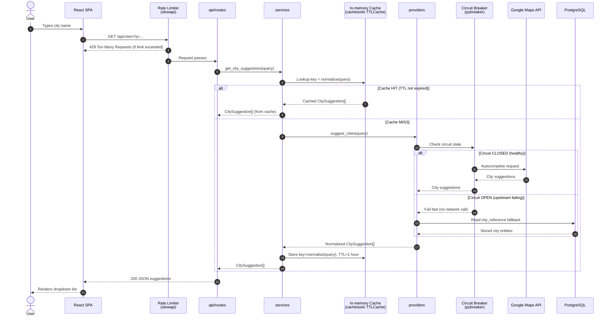
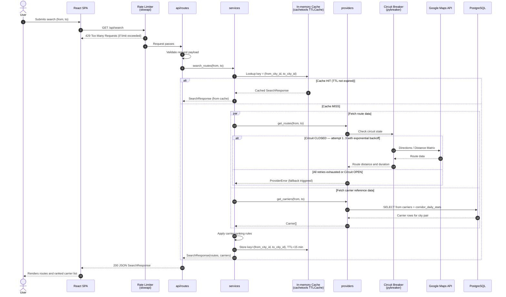
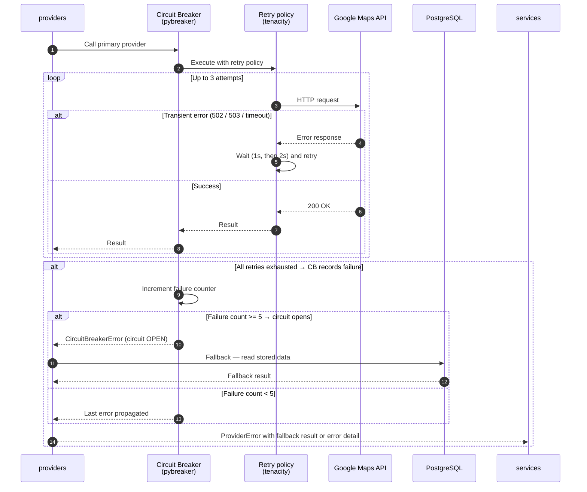
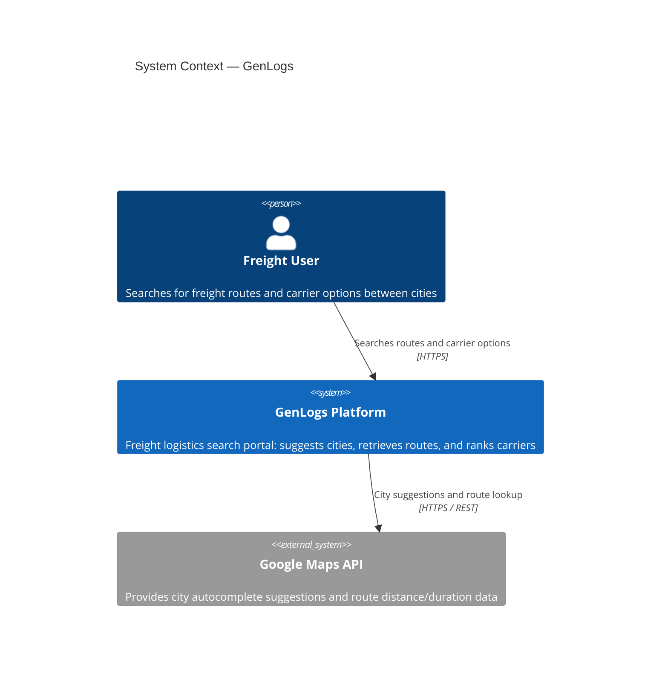
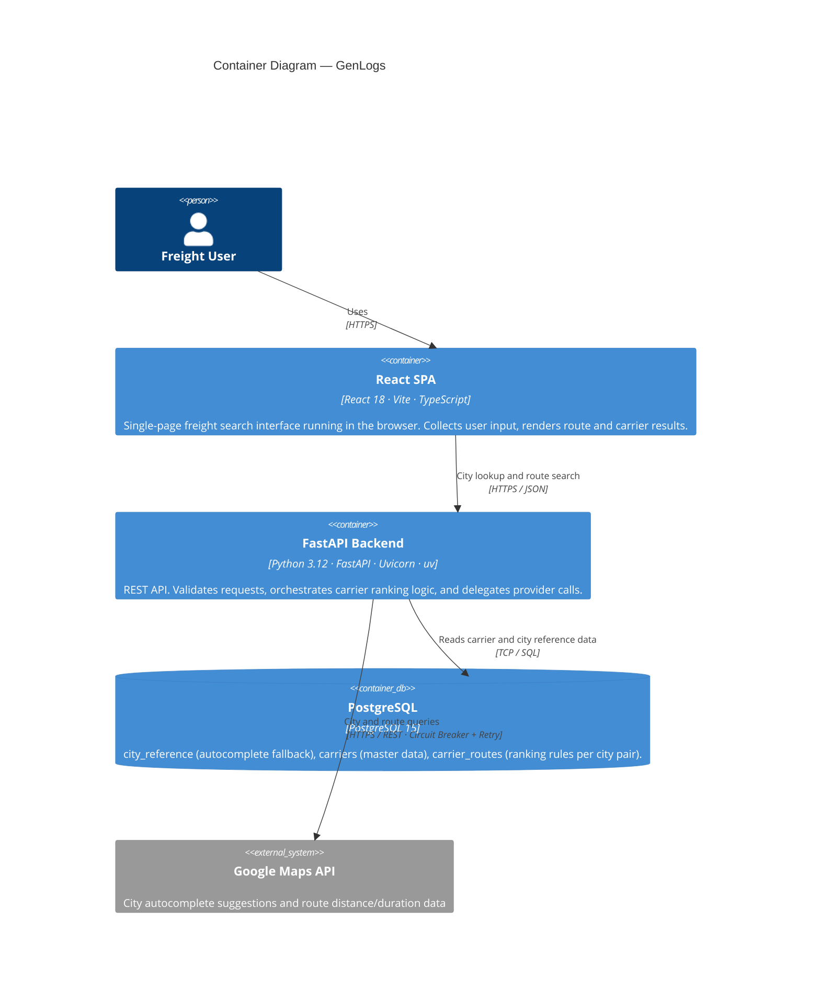
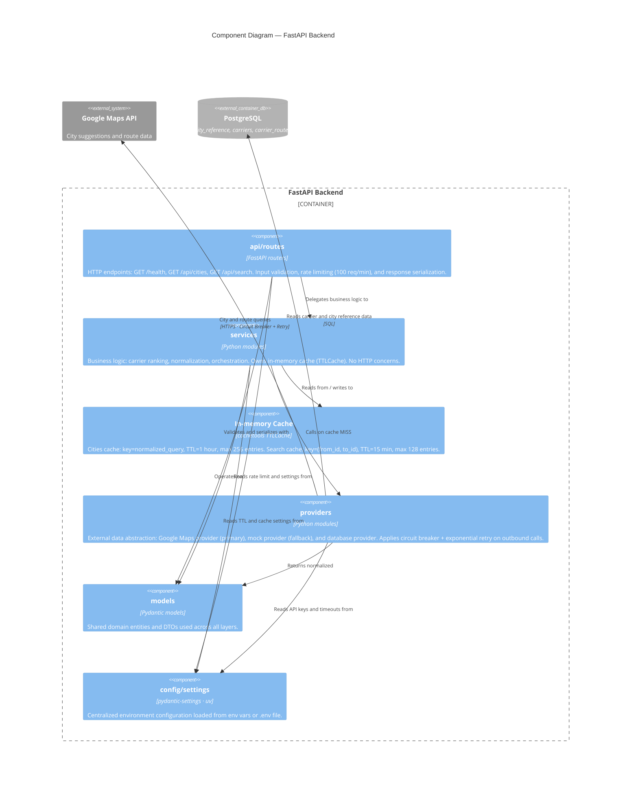
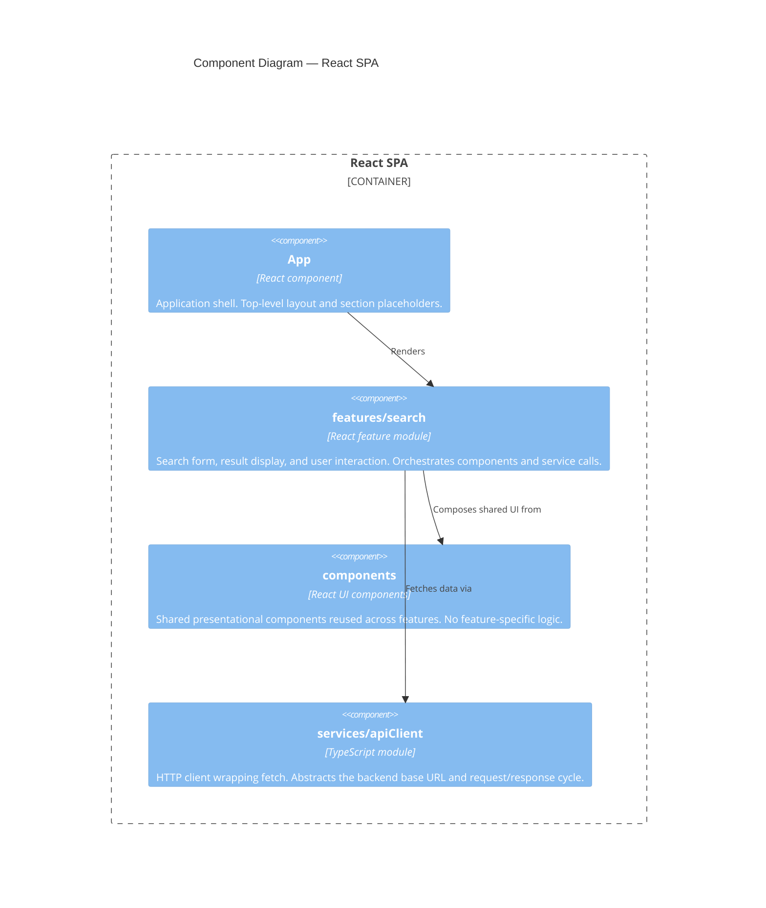

# Architecture specification

## Architectural intent
The MVP should stay simple, implementation-friendly, and easy to demo. A lightweight layered architecture is enough for the requested scope.

## Data flow diagrams

### City suggestion flow
Triggered when the user types in the origin or destination field.



### Route search flow
Triggered when the user submits the search form with origin and destination selected.


    Routes-->>SPA: 200 JSON SearchResponse
    SPA-->>User: Renders routes and ranked carrier list
```

### Error and resilience flow
Shows how provider failures and circuit-breaker state changes are handled.



## C4 diagrams

### Level 1 — System context
Shows GenLogs in relation to its users and external systems.



### Level 2 — Container diagram
Shows all runtime containers and how they communicate.



### Level 3 — Backend component diagram
Shows the internal layers of the FastAPI backend and their external dependencies.



### Level 3 — Frontend component diagram
Shows the internal layers of the React SPA.



## High-level modules
1. **Frontend SPA**
   - React single-page client
   - Search form, route results, carrier results, and error states
2. **Backend API**
   - FastAPI application
   - Request validation, orchestration, and shared error mapping
3. **Carrier service**
   - Deterministic ranking logic based on canonical city pairs
4. **Maps provider layer**
   - Primary provider: Google-backed city lookup and route lookup
   - Secondary provider: fallback implementation with the same contract
5. **Shared contracts**
   - DTOs and API schemas used by both implementation and tests

## Proposed runtime layout
```text
Browser
  -> React SPA
     -> FastAPI API
        -> CarrierService
        -> MapsProvider (Google primary, fallback secondary)
```

## Information flow
### City suggestion flow
1. The frontend sends the current search text to `GET /api/cities`.
2. The backend validates the query.
3. The backend asks the active maps provider for city suggestions.
4. The provider response is normalized into the shared `CitySuggestion` contract.
5. The backend returns normalized suggestions to the frontend.

### Route search flow
1. The frontend submits the selected `from` and `to` cities to `GET /api/search`.
2. The backend validates the request.
3. The backend asks the primary maps provider for routes.
4. If the primary provider fails, the backend retries through the fallback provider.
5. The backend resolves carrier rankings from the canonical business rules.
6. The backend returns a unified `SearchResponse`.
7. The frontend renders the routes, carrier list, and any user-facing error state.

## Package layout target
```text
genlogs_platform/
  specs/
  backend/
    app/
      api/
      services/
      providers/
      models/
      config/
  frontend/
    src/
      features/search/
      components/
      services/
  tests/
    backend/
    frontend/
    functional/
```

## Backend toolchain
| Concern | Tool |
|---|---|
| Language | Python 3.12+ |
| Framework | FastAPI |
| ASGI server | Uvicorn |
| Package manager | **uv** (Astral) — replaces pip for installs, virtual-env management, and lock-file generation |
| Dependency manifest | `pyproject.toml` with `uv.lock` |
| Linter | pylint (10.00/10 quality gate) |
| Architecture tests | archon-architecture + pytest |

## Backend responsibilities
1. Own all provider credentials and outbound provider calls.
2. Normalize city names and request payloads before business-rule evaluation.
3. Decide when to use the fallback provider.
4. Map provider errors into shared application errors.
5. Keep carrier rules independent from route-provider details.

## Frontend responsibilities
1. Collect user input on a single page.
2. Display suggestion lists, validation feedback, and asynchronous loading states.
3. Submit only selected city entities, not raw strings, for the main search request.
4. Render route summaries and carrier results from the backend contract.
5. Remain unaware of which maps provider is active.

## Configuration
1. `GENLOGS_MAPS_PROVIDER=google|mock`
2. `GENLOGS_GOOGLE_API_KEY=<secret>`
3. `GENLOGS_REQUEST_TIMEOUT_SECONDS=<int>`
4. `GENLOGS_RATE_LIMIT=100/minute` — rate limit applied to public endpoints; default `100/minute`

## Resilience patterns

### Outbound calls — providers layer (ADR-017)
All outbound HTTP calls made by the `providers` layer must apply:

| Pattern | Configuration |
|---|---|
| **Exponential retry** | Max 3 attempts (1 call + 2 retries). Backoff: 1 s → 2 s. Retry only on `502`, `503`, `504`, and network timeout. |
| **Circuit breaker** | Opens after 5 consecutive failures. Cool-down: 30 s. Half-open probe after cool-down. |

Libraries: `tenacity` (retry) + `pybreaker` (circuit breaker).  
Responsibility boundary: retry and circuit-breaker logic lives **only** in `providers/`. It must not be duplicated in `services` or `api/routes`.

When the primary provider's circuit is open or all retries are exhausted, `services` triggers the fallback provider.

### Inbound calls — api/routes layer (ADR-018)
Public endpoints are protected by a rate limiter:

| Endpoint | Limit |
|---|---|
| `GET /api/cities` | 100 requests / minute / client IP |
| `GET /api/search` | 100 requests / minute / client IP |
| `GET /health` | *(exempt)* |

Library: `slowapi`. Responses that exceed the limit return `429 Too Many Requests` with a `Retry-After` header.  
The limit value is configurable via `GENLOGS_RATE_LIMIT` in `backend/app/config/settings.py`.

## Error strategy
1. Validation errors return a stable `400` error response.
2. Unknown or unsupported routes return a user-readable `404` or domain-specific empty result, depending on the final implementation choice.
3. Provider failures return a stable `502`-style application error if both primary and fallback fail.
4. Provider-specific details stay in logs, not in public API messages.

## Delivery constraints
1. The MVP must be runnable locally.
2. The frontend should be easy to deploy as a static client or lightweight web app.
3. The backend should be deployable as a small web service.
4. The architecture spec should support the broader design writeup requested by the technical test.
